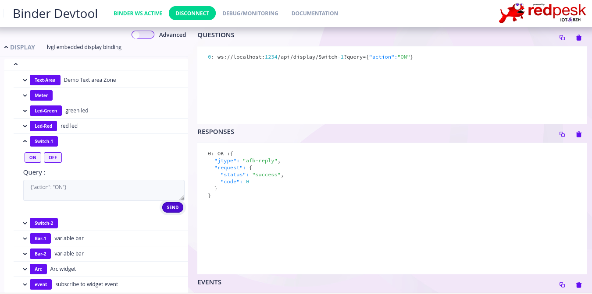

# lvgl-binding-rs
Embedded graphic lvgl Rust afb-v4 binding

## reference:
https://docs.lvgl.io/8/widgets/index.html

## testing without root privilege

1) In order to test without admin privileges, you need access to

* /dev/fb0 generally with 'video' group
* /dev/input0 usually with 'input' group

2) find which virtual console hold /dev/fb0 framebuffer

* switch virtual console with (Alt+Ctrl+F1) (Alt+Ctrl+F2) ...
* after login check with cat /dev/urandom >/dev/fb0

If your screen is repainted, then you are on /dev/fb0 other wise switch to next virtual console.

3) start display-binding

```
display-binding/afb-binding/etc/binding-test.sh
```

## Demo screen on framebuffer


## Demo afb-v4 API




4) Faire un screencast du framebuffer

Copy framebuffer and transform it yo PNG. If needed crop image to content with gimp.
```
cp /dev/fb0 > /tmp/screen.data
RESOLUTION="1920x1080"
ffmpeg -vcodec rawvideo -f rawvideo -pix_fmt rgb32 -s $RESOLUTION -i /tmp/screen.data -f image2 -vcodec png screenshot.png
```
